# Arcana audit and redesign — 2026-10-02

The local app was reviewed from repository source, regression tests, and the real
browser flow. Quiet Atelier is implemented across the homepage, all product
screens, and shared dialogs. The physical-card workflow and premium pricing are
preserved.

## System understanding

Arcana is a static HTML application with ordered global JavaScript. External
templates have embedded fallbacks for file previews. Tailwind compiles the shared
theme; TypeScript compiles the identification parser. Browser storage holds
settings, autosaves, reading history, journal notes, usage, and premium state.
The Cloudflare Worker verifies Gumroad activation and provides an optional Gemini
proxy. Classic interpretation uses built-in meanings and supports offline use.

The guided flow gathers context, establishes a deck, chooses a spread, supports
physical drawing/photo recognition/manual review, then generates a reading.
Quick upload identifies cards before invoking the same structured reading engine.
The later quickRead definition in reading-engine.js intentionally overrides the
legacy UI implementation. Tests use that actual load order.

## Findings fixed

| Area / step | Before | Implemented correction |
| --- | --- | --- |
| Focus, 2 | Toggling off a topic could add another question; removed middle rows could reuse input IDs. | Deselect matching topic text, avoid duplicate topics, generate unique IDs, synchronize pressed state. |
| Resume, 2–7 | Restored state and visible controls could disagree; placement/review routes could show stale cards. | Rehydrate concerns, deck, spread, life stage, dropped card and quick controls; rebuild placement/review on navigation; autosave card and orientation edits. |
| Reading, 8 / upload, 12 | Late asynchronous results could replace a newer reading or chosen Classic mode. | Version reading requests; ignore stale success/failure and photo-identification responses. |
| Reading, 8 | Switching to Classic during generation could avoid usage accounting; failed switches discarded usable output. | Count the first completed reading once; restore previous mode/package/narrative on failure; keep empty-reading actions disabled. |
| Storage, 8–10 | Failed reading/journal writes could still report success; settings and usage writes could throw. | Report success only after persistence; preserve save dialog on failure; safely handle settings/activation writes and session usage. |
| Archive, 9 | Malformed non-array archives could break consumers; reopened readings retained metadata from another reading. | Normalize archives; restore saved mode/package, clear unrelated photo/infographic/journal draft, verify supported layout. |
| Dialogs, 6 / 10–11 | Delayed focus restoration referenced a trigger that had already been cleared; route focus could steal modal focus; picker exposed nested dialogs. | Capture the trigger before clearing it, suppress route focus while a dialog is active, use a single picker dialog. |
| Share, 10 | Global wrapCanvasText definitions had incompatible signatures, removing card names/comments from the canvas. | Give the share drawing helper a distinct name; test it with the reading engine loaded afterward. |
| Share, 10 | Async image drawing held canvas transforms open; older redraws could overwrite newer comments. | Load images before drawing; render offscreen and copy only the latest preview. |
| Reading copy, 8 | Singular card counts used plural verbs. | Correct singular/plural agreement in newly generated Classic readings. |
| Visual system, 1–12 | Dark legacy rules, absolute utilities, and scattered panel treatments complicated the new direction. | Add shared paper/ink tokens, readable forms, inline utilities, mobile layouts, and consistent dialogs. Explicitly override the legacy white first-line hero color. |

## Numbered flow review

These screenshots were saved and visually inspected during this audit. The list
uses accepted captures; rejected or superseded captures are excluded from this
report. Images are viewport views, so some show a relevant section of a long page.

1. **Homepage — passed.** Clear guided/upload entry points; arched physical-card
   image and legible forest headings. Mobile calls to action stack.
   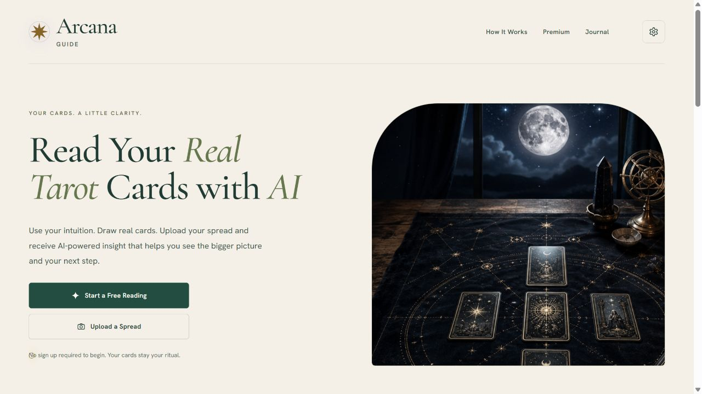
2. **Question / focus — passed after fixes.** Topic toggles and IDs corrected;
   light form and readable guidance.
   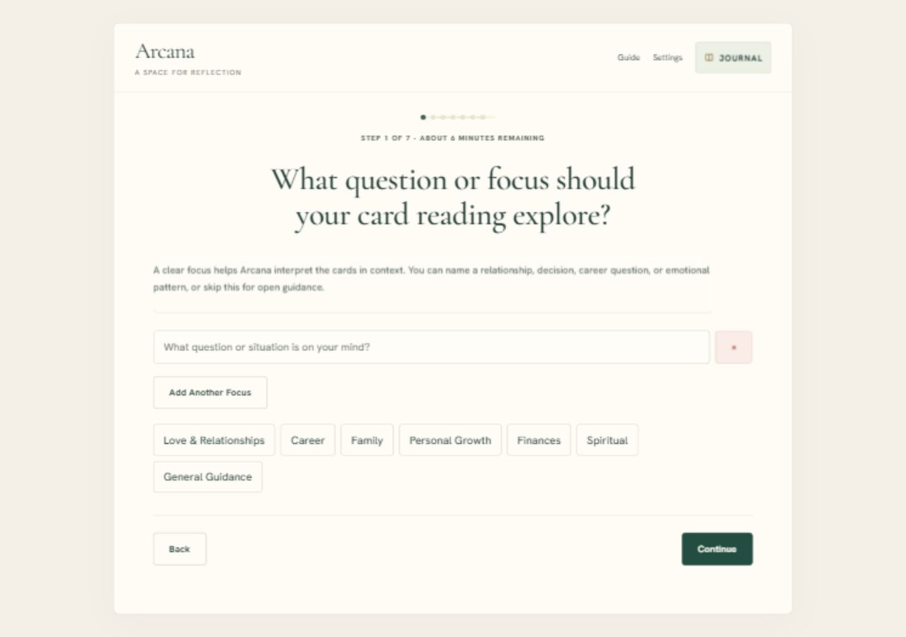
3. **Deck choice — passed.** Tarot and playing-card choices retain their distinct
   behavior and selection state.
   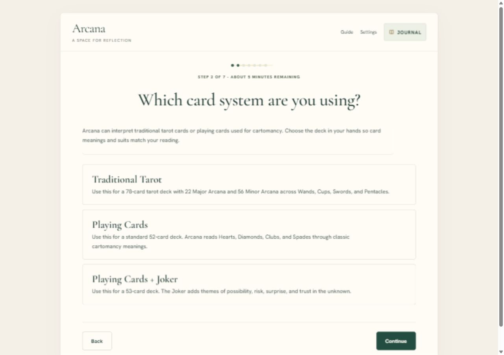
4. **Spread choice — passed.** Recommended and advanced options remain available;
   no document overflow at 390px.
   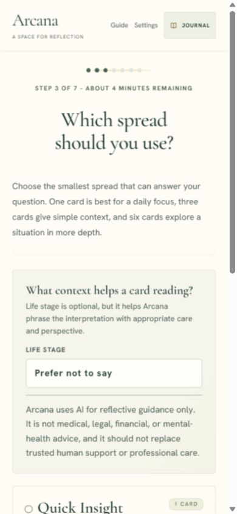
5. **Preparation — passed.** Physical shuffle/draw instruction preserved with
   quieter typography and mobile navigation.
   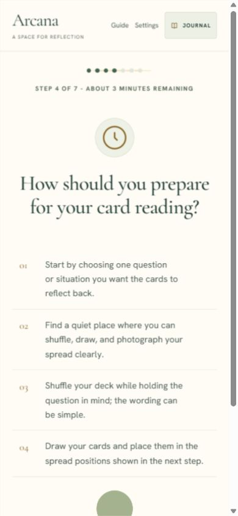
6. **Placement / manual picker — passed after fixes.** Restored card visible;
   orientation/edit paths remain available. Picker closes to its trigger and has
   one dialog. Its filter strip scrolls internally.
   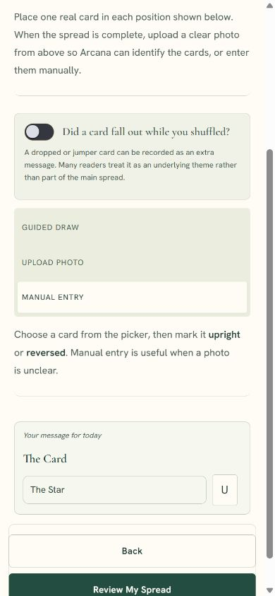
   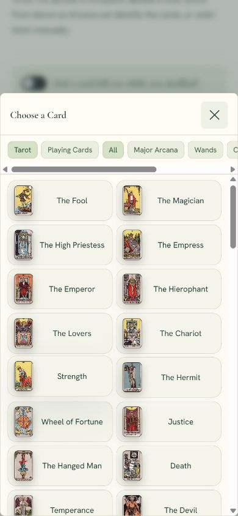
7. **Spread review — passed.** Confirmed cards render; each populated position has
   an explicit Edit card action.
   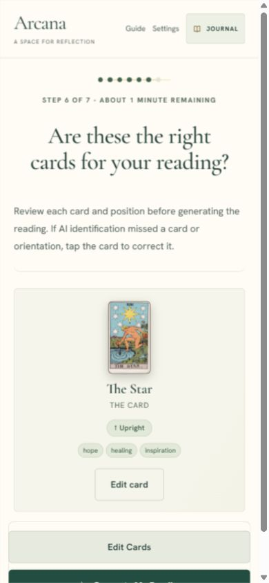
8. **Reading / reflection — passed after fixes.** AI and Classic paths exercised;
   Classic visibly selected, summary and manuscript readable. Saving and reopening
   a synthetic reading/reflection worked.
   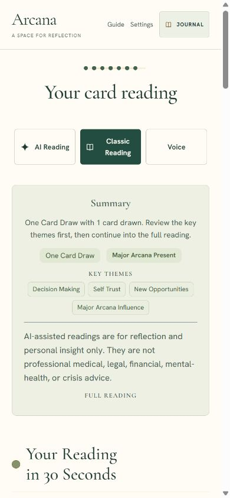
9. **Archive / journal — passed after fixes.** Saved reading and its reflection
   open through the journal link; restored reading mode is selected.
   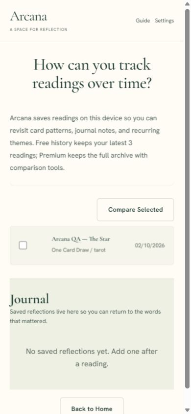
10. **Settings / share — passed after fixes.** Settings scroll on mobile. Escape
    returns focus. Final share fallback displays The Star and the latest comment.
    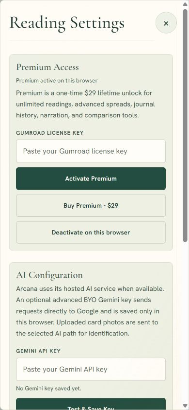
    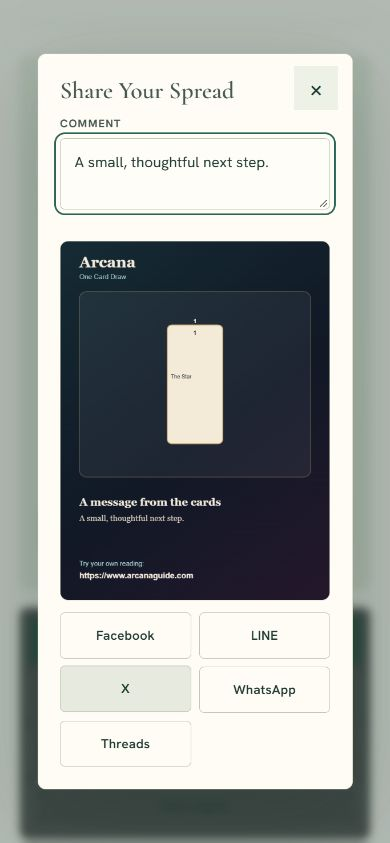
11. **Help — passed.** Guide retains practical real-card and AI instructions;
    scrollable paper dialog with readable hierarchy.
    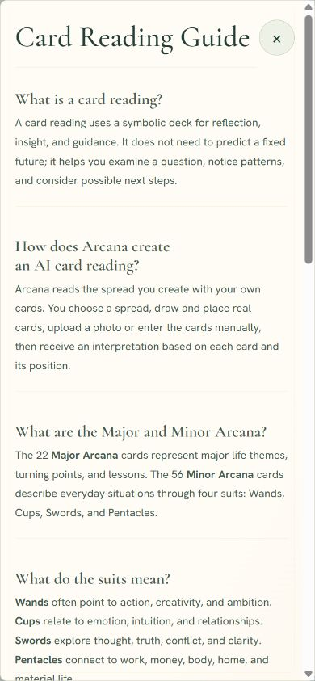
12. **Quick upload — UI passed; live photo recognition not exercised.** Deck/spread
    options and entry point work. Parser and stale-photo behavior covered by tests.
    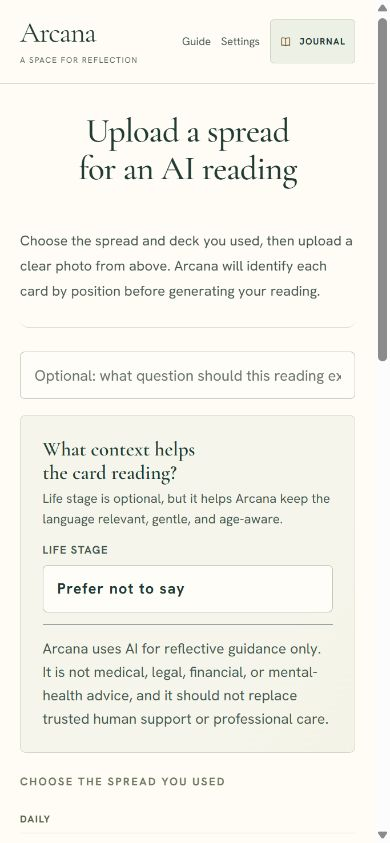

## Verification and limits

- Fresh `npm run build` and `npm test` pass; the suite includes Worker/security,
  identification, deck selection, life-stage safeguards, reading actions,
  monetization configuration, journal, homepage, shell, and the new workflow tests.
- Syntax checks for all edited plain JavaScript and `git diff --check` pass.
- Desktop (1280px) and mobile (390px) checks cover the major routes; measurements
  are saved in `measurements.json`. Checked documents have zero horizontal overflow.
- Final clean browser session warning/error logs are empty. Earlier focus errors
  observed during the audit were corrected and retested.
- Settings and picker Escape/focus return were exercised. Screenshots and these
  checks do not establish full accessibility compliance; a screen-reader audit,
  exhaustive contrast measurement, and OS print/narration checks remain outside
  this pass.
- One hosted AI text reading with synthetic context completed. No live payment,
  license purchase, personal photo transmission, or social posting was performed.
  Remote card artwork can fail; the tested canvas fallback now includes names.
- A synthetic reading/reflection exists only in the local preview browser; no
  example data was added to application storage seeds or repository assets.
- Changes are local and have not been deployed.
