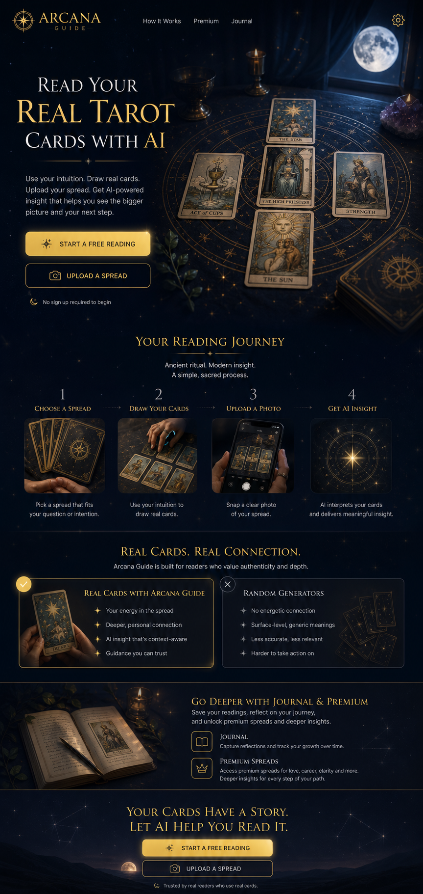

# Arcana Ritual Stage Homepage Design

## Summary

Redesign the Arcana Guide homepage first, using the approved "Ritual Stage" concept as the visual target. This is a visual and experience polish pass over the existing static single-page app. It must preserve the current product behavior, routes, forms, payment logic, AI configuration, reading flow, local storage, and all user workflows.

Approved concept:

## Scope

This spec covers the homepage only:

- `templates/welcome.html`
- The embedded `template-welcome` fallback in `index.html`
- Homepage-specific styling in `src/premium-theme.css`, compiled to `css/premium.css`
- Any small shared token refinements needed to support the homepage visual system

Follow-on work will carry the same visual language into reading, journal, history, settings, and modal surfaces after the homepage is approved and implemented.

## Non-Goals

- Do not rebuild the app in React, Next.js, or another framework.
- Do not change navigation behavior, screen ids, hash routes, click handlers, premium gates, settings behavior, or AI behavior.
- Do not change pricing logic, API integrations, local storage keys, or authentication/payment assumptions.
- Do not replace the product with a chatbot, tarot database, social app, course funnel, or generic marketing site.
- Do not introduce new required data sources or runtime dependencies for the homepage.

## Product Positioning

The homepage must make this promise immediately clear:

> Read Your Real Tarot Cards With AI

Arcana Guide should feel like an intelligent oracle for physical-card readings. The user shuffles and draws their own real cards; Arcana supports the ritual with spread guidance, photo identification, AI interpretation, and reflection.

The experience should communicate:

- Real physical tarot cards, not a random generator
- AI-powered spread interpretation
- Personal insight and reflection
- Journaling as memory and growth
- Premium, cinematic oracle atmosphere

## Visual Direction

Use the approved Ritual Stage concept as the north star:

- A moonlit ritual table with real tarot cards arranged in a spread
- Deep navy, indigo, black, and subtle purple atmosphere
- Gold celestial lines, constellation details, and tiny star particles
- Editorial serif typography with strong scale contrast
- Crisp sans-serif UI text for controls and body copy
- Refined glass and gold surfaces with 8px radii
- Tactile tarot and journal imagery supported by code-native UI

The homepage should feel cinematic and premium, but still easy to understand on first visit.

## Design Tokens

Use the existing theme as the base and refine toward the prompt colors:

- Primary background: `#080B17`
- Secondary background: `#0F172A`
- Accent gold: `#D4AF37`
- Bright gold: `#F5D76E`
- Moon silver: `#E5E7EB`
- Mystic purple: `#7C3AED`
- Star white: `#F8FAFC`

Typography:

- Display: current self-hosted `Cormorant Garamond`, with styling inspired by Cinzel and Playfair Display
- Body/UI: current sans fallback stack, tightened toward Inter-like clarity
- Headings should be dramatic but readable
- UI controls should use deliberate sizing and weight, not browser defaults

Shape and elevation:

- Keep cards, panels, buttons, and media frames at 8px radius
- Use thin gold borders and inset highlights sparingly
- Use soft glows for focus, not heavy drop shadows
- Avoid nested cards

## Homepage Structure

### 1. Header

Purpose: orient the user without stealing attention from the hero.

Required elements:

- Arcana Guide brand lockup
- Minimal navigation labels: `How It Works`, `Premium`, `Journal`
- Settings icon button, preserving `openModal('modal-settings')`

Design:

- Transparent or subtly glassy top bar over the cosmic background
- Gold brand mark and letterspaced wordmark
- Clear touch targets on mobile
- Nav may scroll to homepage sections if implemented, but must not break existing screen navigation

### 2. Hero

Purpose: communicate the product promise and drive the primary reading action.

Required copy intent:

- Main headline: `Read Your Real Tarot Cards With AI`
- Supporting copy should explain: draw real cards, upload the spread, receive AI-powered insight
- Primary CTA: `Start a Free Reading`, preserving `startGuided()`
- Secondary CTA: `Upload a Spread`, preserving `startQuick()`
- Existing daily/free reading status should remain visible if entitlement logic renders it

Design:

- Full cinematic first viewport with a large real-tarot ritual table visual
- Headline on the left, tarot spread visual dominant on the right or as full-bleed background
- Gold CTA with strong contrast and a quieter outlined secondary CTA
- Moonlight, star particles, table texture, and celestial spread lines
- A hint of the next section visible on common desktop and mobile viewports

Implementation note:

Use real image assets for the central tarot-table atmosphere if practical. If the final hero image is generated, save it under the project assets and reference it from CSS/HTML. Keep all actual UI copy and buttons code-native.

### 3. Reading Journey

Purpose: explain the product workflow as a memorable ritual, not a generic feature grid.

Required steps:

1. Choose a spread
2. Draw your cards
3. Upload a photo
4. Get AI insight

Design:

- Four visual steps connected by delicate gold/constellation lines
- Each step should include a small image or strong visual motif
- Copy should stay short and concrete
- The section should reinforce physical-card authenticity

### 4. Real Cards vs Random Generators

Purpose: sharpen differentiation and trust.

Design:

- Two-column comparison inspired by the concept
- Left side: `Real Cards With Arcana Guide`
- Right side: `Random Generators`
- Left side should feel warmer, brighter, and selected
- Right side should be muted, but not hostile or gimmicky

Messaging:

- Real cards preserve the user's ritual and intention
- AI interprets the actual spread context
- Random generators feel less personal and less grounded

### 5. Journal and Premium

Purpose: increase perceived value without turning the homepage into a pricing page.

Design:

- A tactile journal scene or refined editorial section
- Mention saved readings, reflections, premium spreads, narration, and deeper archive benefits
- Keep pricing details concise and consistent with existing Premium logic
- Preserve any existing premium activation or purchase behavior outside the homepage

### 6. Final CTA

Purpose: close the page with a simple action.

Required CTAs:

- `Start a Free Reading`, preserving `startGuided()`
- `Upload a Spread`, preserving `startQuick()`

Design:

- Night-sky or horizon-style closing panel
- Strong headline: `Your Cards Have A Story. Let AI Help You Read It.`
- Keep copy concise and emotionally clear

## Interaction and Motion

Motion should feel magical and premium, never distracting.

Recommended CSS-first interactions:

- Slow star twinkle and particle drift
- Subtle hover lift on action tiles and journey media
- Soft gold glow on CTA hover/focus
- Section fade/translate reveal where feasible
- Reduced-motion support that disables nonessential movement

Do not add a heavy animation runtime unless a later implementation plan proves it is necessary. The current stack has no Framer Motion or GSAP, so homepage motion should start with CSS.

## Responsiveness

Mobile must be designed intentionally, not treated as a squeezed desktop.

Mobile requirements:

- Hero headline remains readable and unclipped
- CTAs stack cleanly with stable button heights
- Hero tarot visual remains present, but may move above or behind the copy
- Reading journey becomes a vertical ritual path
- Comparison section stacks with the Arcana side first
- Header nav may simplify, but settings remains accessible
- Text must not overlap imagery or decorative effects

## Accessibility

- Preserve semantic headings and button elements.
- Maintain visible focus states for all interactive elements.
- Ensure CTA contrast passes against dark backgrounds.
- Decorative particles, stars, and tarot imagery should be hidden from assistive tech.
- Respect `prefers-reduced-motion`.
- Do not rely on image text for core product messaging.

## Implementation Architecture

The app is a static HTML/CSS/vanilla JavaScript SPA. The homepage redesign should follow that architecture.

Template strategy:

- Update `templates/welcome.html` first.
- Sync the same markup into the embedded `template-welcome` in `index.html`.
- Preserve all existing `onclick` handlers unless the implementation plan explicitly replaces them with equivalent existing functions.

Styling strategy:

- Add homepage-specific classes and tokens in `src/premium-theme.css`.
- Rebuild `css/premium.css` with `npm run build:css`.
- Avoid broad global changes unless they are needed for the homepage and do not regress other screens.

Asset strategy:

- Store any final homepage raster assets in a project asset directory.
- Do not reference generated images from `C:\Users\admin\.codex\generated_images` in production code.
- Keep UI text, buttons, nav, and forms code-native.

## Data Flow

The homepage does not need new data flow.

Existing functions and data should remain:

- `startGuided()`
- `startQuick()`
- `goScreen('screen-history')`
- `openModal('modal-settings')`
- `renderEntitlementsUI()` updates for subscription/free-reading status
- Premium feature attributes such as `data-premium-feature`

## Error Handling

The homepage itself should not introduce new error states. Existing modal, premium, settings, AI-key, and reading-flow error behavior must remain untouched.

If a homepage image asset fails to load, the layout should still show readable copy, CTAs, and a graceful atmospheric background.

## Testing and Verification

After implementation, verify:

- `npm run build`
- `npm test`
- The homepage loads at `http://127.0.0.1:4173/`
- `Start a Free Reading` enters the guided reading flow
- `Upload a Spread` opens the quick upload flow
- Settings icon opens the existing settings modal
- Premium/journal entry points retain existing gates
- Desktop and mobile layouts have no overlapping or clipped text
- Motion respects reduced-motion preferences
- External `templates/welcome.html` and embedded `template-welcome` stay in sync

Visual verification should compare the implemented homepage against the approved concept image for:

- First viewport composition
- Headline and CTA hierarchy
- Dark cosmic palette
- Tarot spread prominence
- Journey section structure
- Real-cards comparison
- Journal/premium section mood
- Final CTA rhythm

## Open Decision Locked

The selected visual direction is `Ritual Stage`. The other generated concepts are not active targets.
